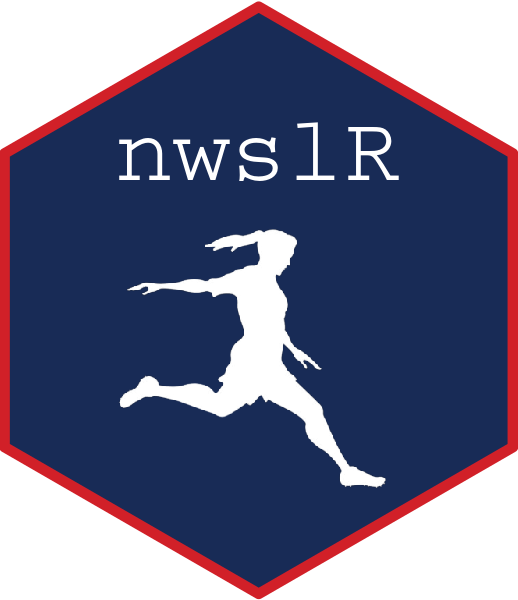

<!-- README.md is generated from README.Rmd. Please edit that file -->

# nwslR 

<!-- badges: start -->
[](https://www.tidyverse.org/lifecycle/#experimental) [](https://github.com/nwslR/nwslR/actions/workflows/R-CMD-check.yaml)
<!-- badges: end -->

`nwslR` is an R ecosystem that contains datasets and analysis functionality for the National Women’s Soccer League (NWSL). Founded in 2013, the NWSL is the United States’ top professional women’s soccer league, featuring players from all over the world. In an effort to create a reproducible and friendly ecosystem, the setup is heavily inspired by the [nflverse](https://github.com/nflverse). Many thanks to [Tan Ho](https://github.com/tanho63) for all his help and advice. An earlier version of the package, created in collaboration with [Sophia Tannir](https://github.com/sophiatannir), exists [here](https://github.com/adror1/nwslR). It is no longer maintained. 


Accessibility of data in women's sports (and particularly soccer) lags behind its male counterparts. This package is a contribution to a growing ecosystem of open data sources that aims to make data available to fans and analysts of the league. The main package, `nwslR`, provides functions to easily access data that is loaded in the [nwsldata repo](https://github.com/nwslR/nwsldata). Data is updated several times a week during the season and more sporadically in the offseason. 

If you see anything you'd like added, changed, or updated, please open up a new issue of your own. If you are interested in contributing, please contact us directly. If you use this data in any work, please cite us. 

This package is currently in the process of changing and updating significantly, so it is suggested that you frequently update it so that you have access to the most recent version. CRAN submission will come when it reaches a stable state. 


## Installation

You can install the development version of nwslR from [GitHub](https://github.com/) with:

```{r hide = TRUE}
knitr::opts_chunk$set(
  fig.path = "man/figures/README-"
)
```

``` {r eval=FALSE}
# install.packages("devtools")
devtools::install_github("nwslR/nwslR")
```

## Available Table Types

- `load_player_match_stats()`: Loads player level stats for a given match
- `load_player_season_stats()`: Loads player level stats for a team/season
- `load_team_match_stats()`: Loads team level stats for a given match
- `load_team_season_stats()`: Loads team level stats for a team/season

## ID Tables

- `load_matches()`: All matches from 2016-present with information and match IDs
- `load_players()`: All players rostered from 2016-present with information and player IDs
- `load_teams()`: All teams active from 2016-present with information and team IDs
- `load_metrics()` All metrics available from scrapers with definitions. Not all metrics are available
for all players/matches/teams/etc.

# Examples:

## Example 1: Which player had the highest percentage of shots outside the box? 

First, we want to load the data. While the match stat load functions currently only take single
inputs, we can use `purrr` to pull several matches at once. 

```{r load_packages}
library(nwslR)
library(magrittr)
library(ggplot2)
```

```{r load_match_data, warning=FALSE, message=FALSE}
matches_2022 <- load_matches() %>%
  dplyr::filter(season == 2022)

players <- load_players()

# * A small number of matches do not have data, so we wrap this in a safe call to ensure this runs without error 
safe_load_pms <- purrr::possibly(load_player_match_stats, otherwise = data.frame())

player_stats <- purrr::map_df(matches_2022$match_id, safe_load_pms, .progress = TRUE)
```

We then calculate percentage of shots outside of the box for each player and format labels for plotting. 
```{r wrangle_data}
player_shots <- player_stats %>%
  dplyr::select(player_id, team_id, shots_total, shots_outside_box) %>%
  dplyr::group_by(player_id) %>%
  dplyr::summarise(shots_total = sum(shots_total), 
                   shots_outside_box = sum(shots_outside_box), 
                   percent_outside_box = shots_outside_box/shots_total) %>%
  dplyr::filter(shots_total >= 15) %>%
  dplyr::left_join(players, by = "player_id") %>%
  dplyr::mutate(name_label = dplyr::coalesce(player_known_name, paste(player_short_first_name, player_short_last_name, sep = " "))) %>%
  dplyr::arrange(percent_outside_box) %>%
  dplyr::slice_max(percent_outside_box, n = 10)
```

Finally, plot!
```{r plot}
ggplot(player_shots) + 
  geom_bar(aes(x = reorder(name_label, percent_outside_box), y = percent_outside_box), 
           stat = "identity", 
           fill = "#3765b0") +
  scale_y_continuous(labels = scales::percent, limits = c(0, 1)) + 
  labs(x = "", 
       y = "% of Shots Outside Box", 
       title = "NWSL 2022 Regular Seasons: Players with Highest % of\nShots Outside of Box", 
       subtitle = "Minimum 15 Shots", 
       caption = "Source: nwslR") + 
  coord_flip() + 
  theme_minimal()
```

## Example 2: Points Earned and Lost by Teams

```{r load_season_data, warning=FALSE, message=FALSE}
teams_2022 <- c("CHI", "HOU", "NJY", "RGN", "ORL", "POR", "WAS", "NC", "KCC", "LOU", "LA", "SD")

teams <- load_teams()

team_stats <- purrr::map_df(teams_2022, ~load_team_season_stats(team_id = .x, season = "2022"), .progress = TRUE)
```

```{r}
wrangle_team_pts <- team_stats %>%
  dplyr::select(team_id, pts_gained_from_losing_positions, pts_dropped_from_win_position) %>%
  dplyr::mutate(pts_dropped_from_win_position = 0 - pts_dropped_from_win_position) %>%
  tidyr::pivot_longer(!team_id, names_to = "pts_type", values_to = "points") %>%
  dplyr::left_join(teams, by = "team_id")
```

```{r}
ggplot(wrangle_team_pts) + 
  geom_bar(aes(x = points, y = team_abbreviation, group = team_id, fill = pts_type), 
           stat = "identity") + 
  scale_y_discrete(limits = rev) + 
  scale_x_continuous(limits = c(-16, 16), 
                     breaks = seq(-16, 16, 4), 
                     labels = c(16, 12, 8, 4, 0, 4, 8, 12, 16)) +
  scale_fill_manual(labels=c('Points Lost by Conceding After Leading', 'Points Earned by Winning from Behind'), 
                      values = c("#1f3b5e", "#a53924")) +
  labs(x = "Points", 
       y = "", 
       fill = "", 
       title = "How Did Teams Deal with In-Game Adversity?: Points Earned/Lost By Teams ", 
       subtitle = "2022 NWSL Regular Season", 
       caption = "Source: nwslR") +
  theme_minimal() +
  theme(legend.position = "bottom")
```

